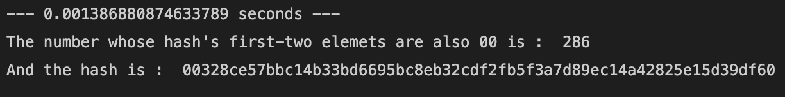

# Block Chain
An implementation of how bitcoins work. This project is based on [this](https://www.youtube.com/watch?v=bBC-nXj3Ng4&list=WL&index=29) video. 

Watching the video is highly recomended for those wishing to understand the components(objects) of the code.

## Understanding different objects(BitCoin-Components)
1. **Legder**

A ledger is a document that keeps the history of transactions. It is basically the currency aka **bit-coin**. Each user is given a copy of the ledger via the ***block***.

2. **Block**

Each block contains the ledger(document of transaction) and the hash of the previous block which nsures an order to the block. It also contains the ```proof-of-work``` i.e. that it was mined by a miner. Once mined, the block is brodcasted to all the users i.e. it is added to the chain. This new block added and all previous blocks can be viewed by all the users. 
 
 ## Understanding different objects(Users)

1. **Customers**

Customers are the people making the transaction. Each customer has the ability to send money to other customers in the chain. The customer sending the amount will create a ledger request and the one recieving will verify the request making the ledger authentic.  

2. **Miners**

Miners are those people who add blocks to the chain after doing some computation. This computation is what was referred to as the `proof-of-work`.  This is done once the transaction is authenticated. 

## How mining works.

Consider a situation where, after a transaction was completed, a random number was added to the ledger. The sha256 hash of the random number is given as `hash = '00bebc5be79d19e1b8b3f250dc39aebfa9a054baf5f8d61380438d92394c476a'`. 

Now, the task of the miners is to find a message such that the first-two elements of the hash of the message corresponds to the first-two elements of the original hash. The first miner to do so will get to add the block and recieve some benefits for utilizing his time/resorces. 

Sample code to explain the procedure.

**EXAMPLE**
```python

given_hash = '00bebc5be79d19e1b8b3f250dc39aebfa9a054baf5f8d61380438d92394c476a'

"""
Task : Find a number such that first-two elements of the hash of the number corresponds to the first-two elements of the given_hash
"""

import time
from Crypto.Hash import SHA256

number = 0 # will begin from 0 and check hash of numbers until the condition is met
h = SHA256.new(str(number).encode('utf-8'))
start_time = time.time()

while h.hexdigest()[:2] != '00': # the first-two elements of the given hash is 00
    number = number + 1
    h = SHA256.new(str(number).encode('utf-8'))
print("--- %s seconds ---" % (time.time() - start_time))

print("The number whose hash's first-two elemets are also 00 is : ", number)
print("And the hash is : ", h.hexdigest())
```


Imagine if the condition was such that the **first-ten** elements had to be same or the **first-thirty**.
The computation would be extremely high. This is what the miners do. 

2. **User**

Each customer is assigned a private key (secret-key) that he/she uses to create a digital signature. Only the user has access to his/her private key. The signature is verified using the user's public key. The public key is shared among all the other users.

## Understanding the work flow
- Everytime a new user object is created, a file is created with the user's private and public key.
- When a user wants to add a ledger, he/she must also pass his/her private key as a parameter so that, using it, a digital signature can be generated. This signature is based on the `bytes-message` passed, and is unique for each user and each message.  
- The reciever then verifies that the amount sent and the sender is correct (will also use the sender's public key to check if the ledger request was signed correctly) and then returns True or False based on that value.
- If the last output is True, the ledger is added to the block.
- A randomly selected miner then mines the block.

## Possible Concerns
Consider 3 users SAM, ALICE and JOSHEPH

1. What if Sam creates a ledger stating that he paid Alice $100 when he didn't?<br>
   ***Alice will simply not verify the ledger.***

2. What if Sam creates a ledger and pays Alice $100 but later backs down?<br>
   ***The verification part uses Sam's public key to verify his signature he signed using his private key. This ensures that it was Sam who made the request as digital signatures cannot be forged unless you have the private key.***  

3. What if Sam tries to add several copies of the previous lines?
   ***Each transaction can have a unique message so that the signature generated for each transaction even for the same user is different.***

3. What if Sam tries to create a ledger stating that Josheph sent Alice $100?<br>
   ***Sam will need Josheph's private_key.***

## How To Use
```python 
from block_chain import *

# create miners - one of them will be randomly selected for the mining process
jack = Miners('Jack')
jill = Miners('Jill')

# generate users and privateKey & publicKey for each user.
'''paramaters
- 'Alice' : Name of the user
- 'root'  : password assigned to the user
''' 
alice = User('Alice', 'root') 
sam   = User('Sam',   'root')

# load private keys of the users to make transfers
sam_key_private   = RSA.import_key(open('../keys/sam/private_keyfile.pem').read()) 
alice_key_private = RSA.import_key(open('../keys/alice/private_keyfile.pem').read())

# add ledgers
'''parameters
- alice : reciepient object
- 135   : The amount sam is sending to alice
- alice_key_private : private key of alice 
'''
# The reciever will have to input his/her password for verification 
sam.add_ledger_request(alice, 135, sam_key_private) 

# The reciever will have to input his/her password for verification 
alice.add_ledger_request(sam, 300, alice_key_private)

# every user has the same data
print(alice.data[0].data, sam.data[0].data)
print(alice.data[1].data, sam.data[1].data)
```

## Limitations
- The block verification (Proof of Work) needs improvement.

- The **mining** and **verification** part requires parallel computing to check who was able to mine and add the block to the block chain. In this case, a miner is randomly chosen., and the mining option is given to him only. 

- Because most of the variables are stored as class variables, everyone has access to each others variables.

## Remarks
All of the explanation and code is based on my understanding of the system. I may be wrong in my understanding of it. If you find any mistakes, do reach out to me. 

To view how the code works, click [here]()

## Project By
Roman Regmi
